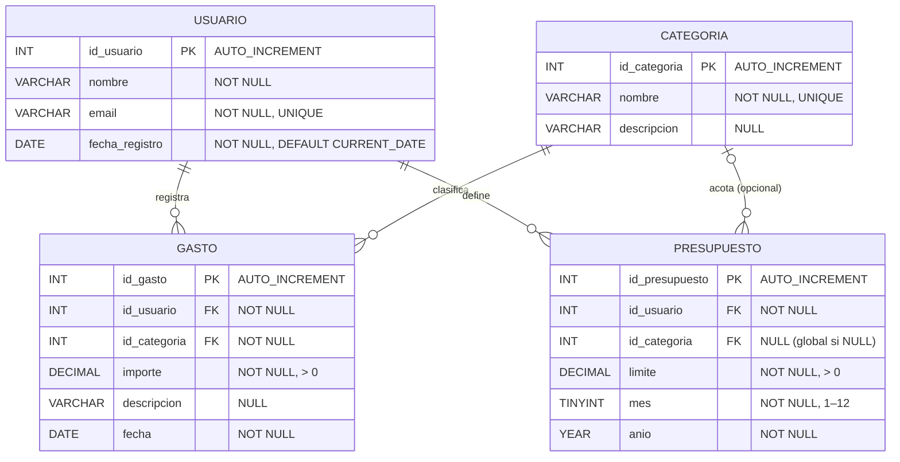

# Diagrama Entidad-Relación — GastosApp

---

## Descripción de relaciones

| Relación | Cardinalidad | Detalle |
|---|---|---|
| USUARIO → GASTO | 1 : N | Un usuario puede tener muchos gastos. `ON DELETE CASCADE` |
| CATEGORIA → GASTO | 1 : N | Cada gasto pertenece a una categoría. `ON DELETE RESTRICT` |
| USUARIO → PRESUPUESTO | 1 : N | Un usuario puede tener varios presupuestos. `ON DELETE CASCADE` |
| CATEGORIA → PRESUPUESTO | 0..1 : N | La categoría es opcional: `NULL` indica presupuesto global mensual. `ON DELETE SET NULL` |

---

## Notas de integridad

- **`GASTO.importe`** — restricción `CHECK (importe > 0)`.
- **`PRESUPUESTO.limite`** — restricción `CHECK (limite > 0)`.
- **`PRESUPUESTO.mes`** — restricción `CHECK (mes BETWEEN 1 AND 12)`.
- **`USUARIO.email`** — restricción `UNIQUE`.
- **`CATEGORIA.nombre`** — restricción `UNIQUE`.
- La combinación `PRESUPUESTO(id_usuario, id_categoria = NULL, mes, anio)` representa el **presupuesto global** del usuario para ese mes.
